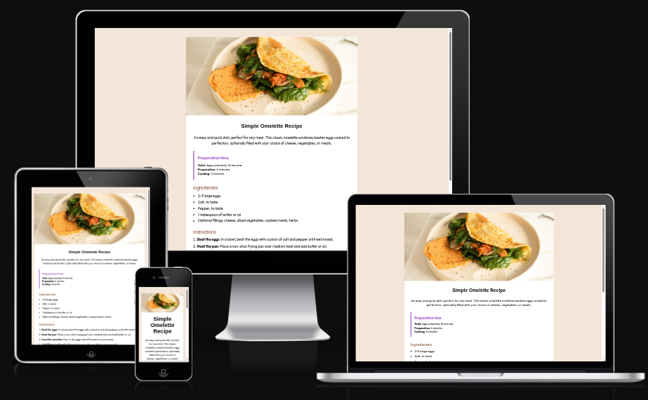

## 🍳 Recipe Page – Tailwind CSS

Esse projeto é uma página de receita criada pra treinar minhas habilidades com HTML e Tailwind CSS.
O foco foi trabalhar layout responsivo, organização visual e um design limpo, sem precisar escrever um monte de CSS manualmente.

## 🚀 O que tem nessa página:

1. ✅ Estrutura HTML semântica;
2. ✅ Estilização rápida e consistente com Tailwind;
3. ✅ Layout responsivo pra desktop e mobile;
4. ✅ Seções bem organizadas: título, imagem, ingredientes, instruções e informações nutricionais;
5. ✅ Fonte personalizada e espaçamento bem distribuído pra leitura confortável;

## 🛠️ Tecnologias usadas:

1. HTML5 → Estrutura da página;
2. Tailwind CSS → Estilização e responsividade;

## 📌 O que aprendi:
Nesse projeto consegui reforçar:

1. Como usar classes utilitárias do Tailwind pra evitar CSS extra;
2. Criar layout flexível que se adapta a várias telas;
